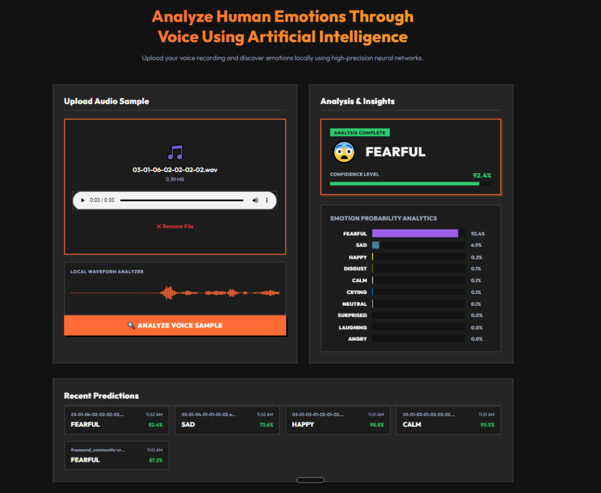
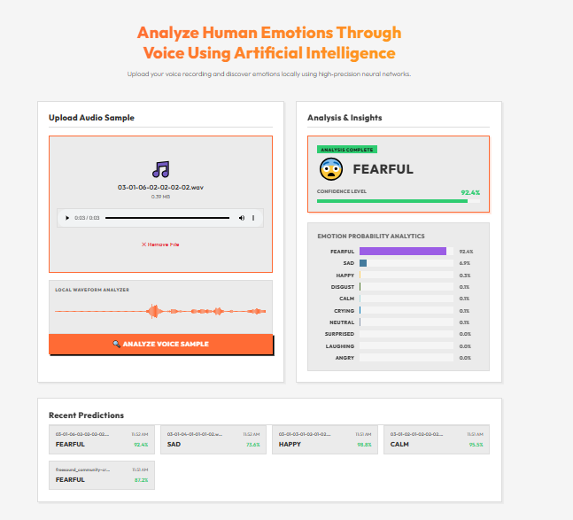

# Voice Emotion Detector AI 🎙️🤖

A complete, production-quality Deep Learning web application that predicts human emotions from voice recordings. The system features a **Flask REST API** backend running local neural network model inference and a **zero-dependency, offline-first dashboard** frontend (React-like design built with HTML5, CSS3, and ES6 Javascript).

---

## 📸 Dashboard Preview

### Dark Mode (Default)


### Light Mode


---

## 📁 Project Architecture

```text
VoiceEmotionDetector/
│
├── backend/                     # Python Flask API Backend
│   ├── app.py                   # Flask server: hosts API endpoint & serves static frontend
│   ├── predict.py               # Model inference pipeline wrapper
│   ├── requirements.txt         # Backend pip dependencies
│   ├── static/                  # Frontend Web Assets (100% local, no Node.js/npm)
│   │   ├── index.html           # Main dashboard HTML structure
│   │   ├── css/
│   │   │   └── style.css        # Premium SaaS dashboard styles (orange, green, grey, white)
│   │   └── js/
│   │       └── app.js           # Reactive UI client (drag-drop, waveform drawer, history)
│   └── uploads/                 # Temporary directory for uploaded audio samples
│
├── model/                       # Model training output artifacts
│   ├── emotion_model.h5         # Trained Keras neural network model
│   ├── scaler.pkl               # StandardScaler object
│   └── label_encoder.pkl        # LabelEncoder classes object
│
├── train.py                     # Training script: scans data, extracts features, trains models
├── predict.py                   # Command-line prediction script
├── utils.py                     # Acoustic feature extraction and audio augmentation pipeline
├── run.bat                      # Double-click startup launcher for Windows
└── README.md                    # Project documentation (this file)
```

---

## 🧠 Model Architecture & Features

### 🎧 Acoustic Features (384 features total)
We extract both the **Mean** and **Standard Deviation (Std)** for:
1.  **MFCCs (Mel-Frequency Cepstral Coefficients)**: 40 coefficients capturing vocal tract shapes (80 features).
2.  **Chroma Features**: 12 pitch classes representing harmonic content (24 features).
3.  **Mel Spectrogram**: 128 Mel bands capturing sound intensity across frequencies (256 features).
4.  **Spectral Contrast**: 7 bands representing sound texture and spectral peaks (14 features).
5.  **Zero Crossing Rate (ZCR)**: Temporal indicator of noise/voiceless sounds (2 features).
6.  **RMS Energy**: Volume/amplitude energy (2 features).
7.  **Spectral Centroid**: Sound brightness center of mass (2 features).
8.  **Spectral Rolloff**: High-frequency rolloff threshold (2 features).
9.  **Spectral Bandwidth**: Spectral spread width (2 features).

### 🕸️ Neural Network Design
The network uses the following sequential architecture:
1.  **Input Layer**: Dense (512 units, ReLU activation, shape=384)
2.  **Batch Normalization & Dropout (40%)**: For regularization
3.  **Hidden Layer 1**: Dense (256 units, ReLU) + Batch Normalization + Dropout (40%)
4.  **Hidden Layer 2**: Dense (128 units, ReLU) + Batch Normalization + Dropout (30%)
5.  **Hidden Layer 3**: Dense (64 units, ReLU) + Batch Normalization + Dropout (20%)
6.  **Output Layer**: Dense (10 units, Softmax activation) representing 10 emotions (RAVDESS + Crying + Laughing).

---

## ⚡ Offline-First UX Features

*   **SoundCloud-style Waveform Visualizer**: Leverages the browser's native `AudioContext` to decode audio binary data locally and render real-time waveforms on an HTML5 `<canvas>` (works 100% offline).
*   **Acoustic Probability Analytics**: Custom responsive horizontal progress bars displaying sorted percentage distributions for all emotions.
*   **Recent Prediction Logs**: Remembers your last 5 voice analyses in `localStorage`. You can reload them instantly by clicking them.
*   **Theme Toggle**: Easily switch between the premium Dark theme and a clean Light theme.

---

## 🚀 Getting Started

### 1. Prerequisites
Ensure you have **Python 3.8 to 3.11** installed on your Windows machine. No Node.js or `npm` installations are needed.

### 2. Environment Installation
Run the following commands inside your command prompt or PowerShell in the project directory:

```powershell
# Create virtual environment
python -m venv venv

# Activate virtual environment
.\venv\Scripts\activate

# Install backend dependencies
pip install -r backend/requirements.txt
```

### 3. Model Training
If you have not trained the model yet, run the main training script to download raw audio assets and export the trained model structure:
```powershell
python train.py
```

### 4. Running the Web Application
Simply **double-click the `run.bat` file** at the project root. This launcher script will:
1.  Activate your virtual environment.
2.  Launch the local Flask server on `http://127.0.0.1:5000`.
3.  Automatically open your default web browser to the dashboard.

---

## 👥 Authors
*   **Built by**: Jivesh Gupta
*   **Program**: BCA AI & ML
